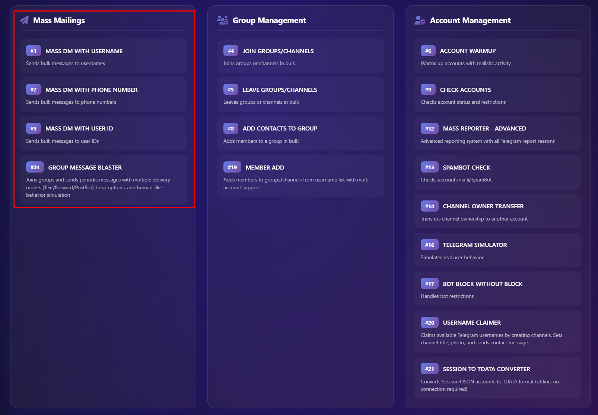
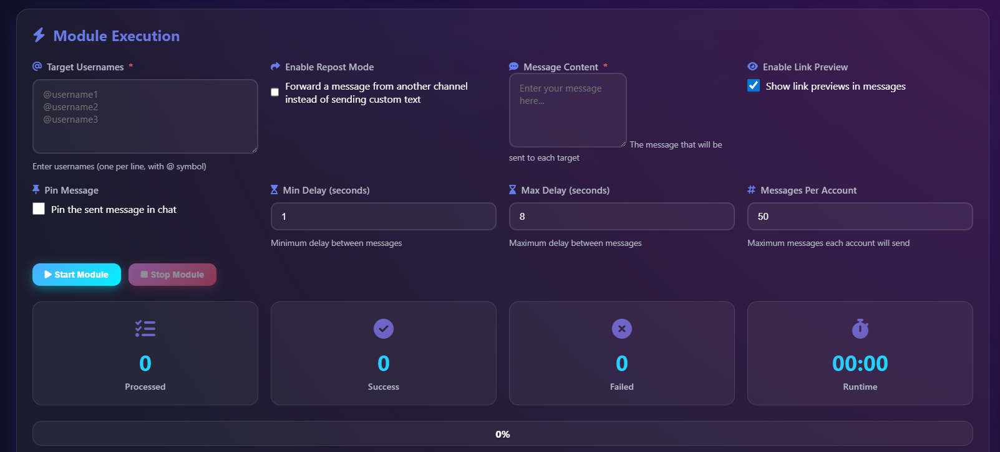
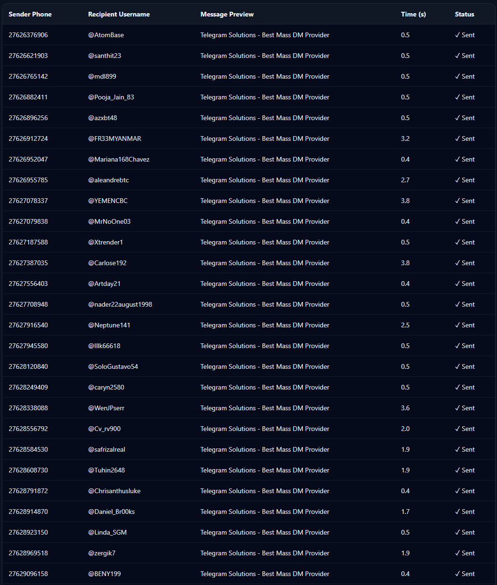

# Telegram Mass DM Bot & Service

A professional **Telegram Mass DM Bot** and **Telegram Mass DM Service** designed for scalable outreach, automation, and high deliverability.

This repository is created for informational and demonstration purposes related to **Telegram Mass DM**, **Mass DM Telegram**, and **Telegram Mass DM Bot GitHub** searches.

## 📩 Access & Contact

For access to the **Telegram Mass DM Service**, demo requests, or custom development:

👉 **Telegram Support:**  

https://t.me/GrowthStudioSupport

---

---

## 🚀 What is Telegram Mass DM?

**Telegram Mass DM** (Mass Direct Messaging) allows sending automated direct messages to Telegram users at scale using controlled, rate-limited systems.

Our **Telegram Mass DM Sender** supports:
- Targeted outreach
- Automated delivery
- Human-like sending behavior
- High inbox placement

---

## 🖼️ Visual Overview

### 📌 Image 1 – Telegram Mass DM Bot Architecture
<!-- IMAGE PLACEHOLDER 1 -->

---

### 🎥 Video – Mass DM Telegram Workflow Demo

> ▶️ Click the preview image to watch on YouTube.

---

### 📌 Image 3 – Telegram Mass DM Sender Dashboard
<!-- IMAGE PLACEHOLDER 3 -->

---

### 📊 Image 4 – Telegram Mass DM Campaign Report

<!-- IMAGE PLACEHOLDER 4 -->

> Post-delivery analytics report showing sent messages, delivery rate, response ratio, failed attempts, and campaign duration for a **Telegram Mass DM Service**.

---

## ⚙️ Telegram Mass DM Bot Features

- Automated Telegram Mass DM Bot
- Advanced Mass DM Telegram system
- Delay & rate control
- Multi-account support
- Proxy compatible
- Human-like sending patterns
- Scalable Telegram Mass DM Service infrastructure

This project is often referenced as:
- **Telegram Mass DM Bot GitHub**
- **Telegram Mass DM GitHub**
- **Telegram Mass DM Extension**
- **Telegram Mass DM Sender**

---

## 🧩 Telegram Mass DM Extension

A **Telegram Mass DM Extension** can be integrated to:
- Manage campaigns
- Control message flows
- Monitor delivery status
- Optimize sending speed

Custom extensions are available on request.

---

## 🛡️ Safety & Compliance

- Smart throttling
- Anti-spam behavior simulation
- Account safety prioritization
- No public API abuse

> This repository does NOT contain public binaries or source code to prevent abuse.

---

## 🔎 SEO Keywords Covered

- telegram mass dm  
- mass dm telegram  
- telegram mass dm bot  
- telegram mass dm service  
- telegram mass dm bot github  
- telegram mass dm extension  
- telegram mass dm github  
- telegram mass dm sender  

---

## ⭐ Disclaimer

This repository is for educational, research, and service presentation purposes only.  
Actual tools are provided privately via Telegram.

---

**Telegram Mass DM Bot & Service – Scalable. Controlled. Professional.**
